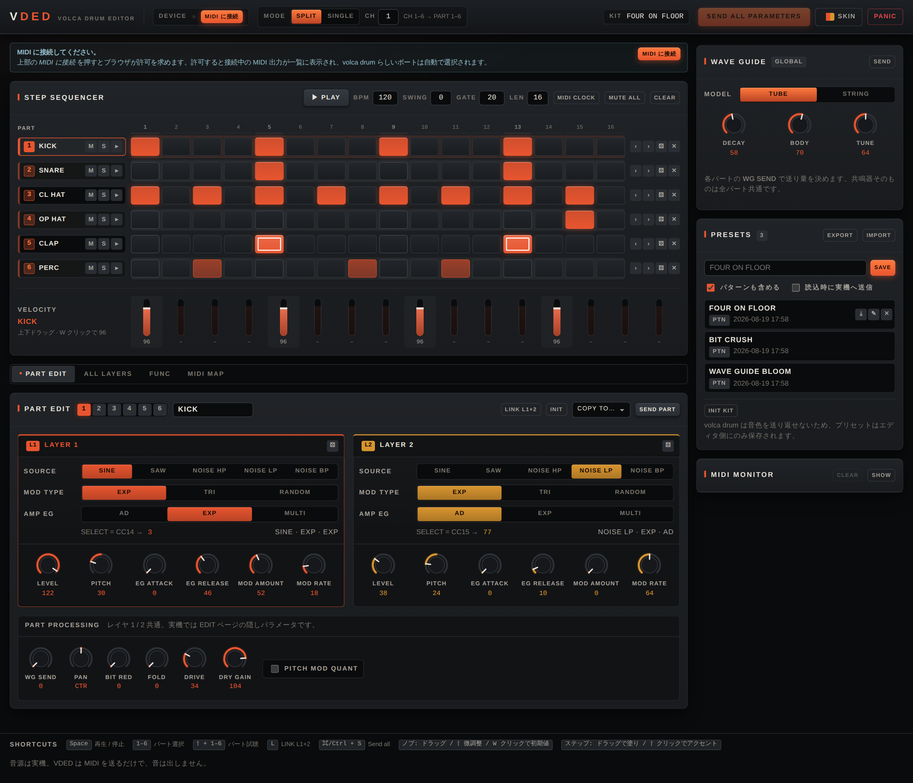

# VDED — KORG volca drum GUI Editor

ブラウザ（Web MIDI API）から実機の **KORG volca drum** をエディットするためのコントロール
サーフェスです。音源は実機のみで、VDED は音を出しません。すべての操作は MIDI で実機へ送られます。

UI は**英語と日本語**に対応しています（初回はブラウザの言語から自動選択、以後は SKIN → TEXT で切替）。
パラメータ名は実機のパネル表記に合わせて両言語とも英語のままです。



---

## 動作環境

| 項目 | 要件 |
| --- | --- |
| ブラウザ | Web MIDI API 対応（Chrome / Edge / Opera などデスクトップの Chromium 系） |
| 接続 | PC → USB-MIDI インターフェイス → volca drum の MIDI IN |
| 実機ファームウェア | **v1.11 以降**（v1.10 以前は BIT の CC が正しく動作しません） |

## セットアップ

```sh
npm install
npm run dev       # http://localhost:5173
```

```sh
npm run build     # dist/ に静的ファイルを出力（そのままどこにでも置けます）
npm run preview
npm test          # CC マップと SELECT エンコードのテスト
```

## 実機側で最初に確認すること

VDED を使う前に、volca drum 本体で次の 2 つを設定してください。ここが合っていないと
**ノブを動かしても一切反応しません**。

1. **MIDI RX ShortMessage を ON。** OFF だとコントロールチェンジを受信しません。
2. **MIDI チャンネルを split channel（既定）に。**
   `●REC` を押しながら電源投入 → ステップボタンでチャンネル選択 → もう一度押すと
   `[MID 1--6]` 表示 → `●REC` で確定。

`MIDI Clock src` は、VDED のシーケンサに同期させるなら `Auto` にします。

## 2 つのチャンネルモード

| | **split channel**（推奨・工場出荷時） | single channel |
| --- | --- | --- |
| チャンネル | パート 1–6 → CH 1–6 | 全パートで 1 本 |
| レイヤ 1 / 2 の個別制御 | ○ | **×**（1 つの CC が両レイヤに効く） |
| BIT / FOLD / DRIVE / DRY GAIN | ○ | **×**（公式チャートに存在しない） |
| PAN / WG SEND | ○ | ○ |
| シーケンサから 6 パートを鳴らす | ○ | ×（鳴るのは選択中のパートのみ） |

**split channel の "split" は、6 つのパートを 6 本の MIDI チャンネルに分割する**という意味です。
CC 番号は全パート共通で、どのパートに効くかはチャンネルが決めます。single channel はその逆に
1 本のチャンネルへすべてを載せ、パートは CC 番号で区別します（パート 1 の LEVEL は CC15、
パート 2 の LEVEL は CC24…というように、パートごとに別の番号が割り当てられています）。

single channel が用意されているのは、送信側がチャンネルを 1 本しか使えない場合や、
1 本の MIDI ケーブルに複数の volca を数珠つなぎしていてチャンネルを節約したい場合のためです
（split では 16 チャンネル中 6 本を volca drum だけで占有します）。
「split にしてパート 1 だけ使う」のとは違い、single なら 1 本のチャンネルのまま
6 パートすべてのパラメータを CC で操作できます。代償として、レイヤ別制御と
BIT / FOLD / DRIVE / DRY GAIN が使えません。

VDED は両モードに対応していますが、single channel ではエディタの大半の機能が実機に届きません。
特別な理由がなければ split channel を使ってください。UI は現在のモードで送れないパラメータを
自動的に無効表示します。

## 画面

### 上部バー

- **DEVICE** — MIDI 出力ポートの一覧・選択。名前に volca と drum を含むポートは
  ★ 付きで表示され、初回接続時に自動で選ばれます。`⟳` で再スキャン。
- **MODE / CH** — split / single の切り替えとベースチャンネル。どちらも選択式で、
  使用するチャンネル範囲が横に出ます。
- **SEND ALL PARAMETERS** — 画面上のすべての値を CC で実機に一括送信します（下記）。
  同じ ⬆ マークは SEND PART・WAVE GUIDE の SEND・各パートの再送信でも共通です。
- **SKIN** — 配色（THEME タブ）と、言語・書体・文字サイズ・表示倍率（TEXT タブ）。設定は保存されます。
- **?** — ショートカット一覧（`?` キー、またはボタンにマウスオーバー）。
- **PANIC** — シーケンサを停止し、使用中のチャンネル／ノートにノートオフを送信します。
  volca drum の音はワンショットなので、鳴っている音そのものはノートオフでは止まりません。
  暴走を止めるという意味では、**シーケンサの停止**が PANIC の実体です。

### STEP SEQUENCER

6 パート × 16 ステップを一覧できるグリッド。

- クリックでステップの ON / OFF、そのままドラッグで塗り
- `Shift` + クリックでアクセント（velocity 127 → 100 → 70 を巡回）
- 拍の区切りは 4 ステップごとの**空白**で示します（4 個ずつのグループを入れ子のグリッドに
  しているので、パッドの幅は 16 個すべて同一のまま、拍だけが離れます）
- velocity 127 のステップはパッドの**上辺のキャップ**で示します（中央を横切る線は取り消し線に
  見えるため、フェーダーが振り切れたときのキャップと同じ形にしています）
- 左のパート欄は **M**（ミュート）/ **S**（ソロ）/ **▸**（試聴）。欄の右端をドラッグすると
  幅を変えられます（ダブルクリックで既定値）
- 各行の右端はパターン操作 — `◀ ▶` シフト、`⚄` ランダマイズ、`✕` クリア
- **MUTE ALL** で全パートを一括ミュート／解除（ミュート中はソロも解除されます）
- 下段の **VELOCITY** レーンは縦型フェーダー。上下ドラッグで値を変更、ダブルクリックで 100
  （新規ステップの既定値）、OFF のステップをドラッグするとその値で ON になります
- レーン右端の **SCALE** は、そのパートの 16 ステップ分の velocity をまとめて倍率で掛けます。
  掛ける対象のフェーダーと同じ形・同じ高さの縦型スライダで、倍率は直接入力もできます
  （スライダを動かしただけでは変化せず、**APPLY** を押したときに適用されます）
- **PLAY / STOP** はパネル見出しの隣。`TEMPO` / `SWING` / `GATE` はダイヤル（実機のパネルに
  合わせています）で、数値をクリックすれば直接入力も可
- `LEN`（パターン長 1–16）
- **MIDI CLOCK** を ON にすると 24ppqn クロックと START / STOP も送信します

シーケンサは VDED 内蔵で、ノートを MIDI で送ることで実機を鳴らします（実機のシーケンサとは別物）。

### WAVE GUIDE（右ペイン）

全パート共通の共鳴器（MODEL / DECAY / BODY / TUNE）。すべてのパートがここへ送り込むので、
どのタブを開いていても触れるよう右ペインに常駐させています。送り量は各パートの **WG SEND** です。

右ペインにはこれと **MIDI MONITOR** だけを置いています。編集中に見えている必要があるのは
この 2 つだけで、プリセットは「テイクの合間に開くもの」としてタブに移しました。

MIDI MONITOR は送信したメッセージを**表**で表示します（種別 / Ch / No. / 値 / 対象）。
CC が連続して流れるときは、桁が揃っていないと読めないためです。常時表示です — ログは
上限付きで、隠しても得るものがありません。下に何も置いていないので画面の高さいっぱいまで
伸ばしてあり、右下をドラッグすれば高さを変えられます。

VDED は **MIDI IN を使いません**。volca drum は音色を送り返さないので受信するものがなく、
入力ポートの選択欄は置いていません。

### PART EDIT

選択中パートのレイヤ 1 / 2 を左右に並べて表示します。

- **SOURCE / MOD TYPE / AMP EG** — 実機の SELECT ノブは 45 通りを 1 つの値に詰め込んでいるため、
  3 つの軸に分解しています。各選択肢には実機の LCD に対応する波形アイコンが付きます。
  合成後の CC 値も併記されます。
- **LEVEL / PITCH / EG ATTACK / EG RELEASE / MOD AMOUNT / MOD RATE** — レイヤごとのノブ。
- **LINK L1+2** — 2 つの LAYER パネルのあいだにある四角いボタン。ON のあいだは両レイヤを
  同時に編集し、`L1+2` の CC 1 通で送信します。ボタンは常に同じ位置にあるので、
  切り替えてもパネルの幅は変わりません（ALL LAYERS タブでも L1 / L2 が括弧で結ばれます）。
  ボタンと枠の色は選択中の PART の色です。
  なお LINK はこれ以降の編集を連動させるもので、押した時点の値を揃えるものではありません。
- **PART PROCESSING** — WG SEND / PAN / BIT RED / FOLD / DRIVE / DRY GAIN。
  実機では EDIT ページの隠しパラメータにあたります。

ノブは縦ドラッグ、`Shift` で微調整、ダブルクリック（または右クリック）で初期値に戻ります。
キーボードの矢印キーでも操作できます。数値フィールド（BPM・CH・CC 番号など）も同じく
**縦ドラッグで変更**でき、クリックすればそのまま自由に入力できます（範囲外の値は確定時に丸められます）。

### ALL LAYERS / DIALS

同じ 12 レイヤを 2 通りの見せ方で用意しています。

- **ALL LAYERS** — 表。数値と横バーで、正確な値を読む・比較する用途。セルはバーの向きに
  合わせて**左右ドラッグ**、ダブルクリックで直接入力。列幅は固定で、12 個の数値欄も
  3 個の選択欄もそれぞれ同じ幅です（自動幅だと一番長い見出しだけ列が広がり、その値が
  重要そうに見えてしまうため）。PART ごとに空白で区切ってあります。PART 名を押すと
  その PART を PART EDIT で開きます。
- **DIALS** — 同じ内容をダイヤルで。音色の「形」を一目で掴む用途。パートごとにカードが
  分かれ、L1 / L2 / パート共通の 3 段構成です。SOURCE / MOD TYPE / AMP EG もここで変更でき、
  カード見出しにはミュート・ソロ・試聴・再送信が並びます。見出し左の**グリップ**を掴めば
  カードを好きな順に並べ替えられ（矢印キーでも可）、パネル右上の**並び順を戻す**で
  実機と同じ PART 1〜6 に戻ります。並び順はワークスペースと一緒に保存されます。

どちらのタブでも **L1 / L2 のバッジ**を押すと、そのレイヤを PART EDIT で開きます。

### FUNC

実機の FUNC ボタンで使える機能の早見表と、VDED 側から実行できる代替操作。
MIDI リアルタイム（START / CONTINUE / STOP）、パートごとのトリガーノート番号、
実機側で設定が必要なグローバルパラメータもここにまとまっています。

### MIDI MAP

送信に使う CC 番号の一覧です。**すべて編集できます。** 手元の個体や将来のファームウェアで
番号が食い違った場合は、この表を直せば再ビルドなしで追従できます。
既定値から変更したセルはオレンジ色で表示され、`RESET TO DEFAULT` で戻せます。

送出間隔（既定: 通常 1.6 ms / 一括送信 4 ms）もここで調整します。取りこぼしがあるようなら
大きくしてください。

### PRESETS

音色（6 パートの全パラメータ＋ WAVE GUIDE）に名前を付けて保存します。
編集中に常時開いておくものではないのでタブに置いています。

- パネル見出しには**いま編集中のキット名**が出ます（以前は上部バーにありましたが、
  この名前を確認するのはプリセットを扱うときだけなので、こちらへ移しました）。
- **SAVE** はブラウザ内（localStorage）への保存、**EXPORT… / IMPORT…** は
  ファイルとしての書き出し・読み込みです。**INIT ALL PARTS** は 6 パート全部と
  WAVE GUIDE を初期化します（PART 単位の初期化は PART EDIT の INIT）。
「パターンも含める」を ON にするとシーケンスも一緒に保存されます。

- 「スキン／フォントも含める」を ON にすると、外観設定も一緒に保存されます
- プリセットはブラウザの localStorage に保存され、`EXPORT` / `IMPORT` で JSON ファイルとして
  やり取りできます
- 読み込み時に「読込時に実機へ送信」が ON なら、そのまま SEND ALL が走ります

## SEND ALL PARAMETERS について

volca drum は **システムエクスクルーシブに対応していません**。つまり:

- 実機の音色を読み出すことはできません（通信は片方向）
- プリセットは実機メモリではなくエディタ側に保存されます
- 画面の状態を実機に反映する唯一の方法が、全パラメータの CC 一括送信です

**SEND ALL PARAMETERS** は split channel で 124 通、single channel で 58 通の CC を、
取りこぼさない間隔で順に送信します。プリセットを読み込んだ直後や、実機を触ってしまって
画面と食い違ったときに押してください。パート単位なら PART EDIT の `SEND PART` が使えます。

## 外観（スキン・フォント）

上部の **SKIN** から選択します。選択内容はプリセットなどと同じ localStorage に保存されます。

| ライト | ダーク |
| --- | --- |
| **Paper**（既定）温かみのある紙色＋バーミリオン | **Vermilion** 実機のパネルに合わせたチャコール |
| **Studio** ニュートラルグレー＋インディゴ | **Carbon** グラファイト＋アンバー |
| **Daylight** 純白＋ティール | **Blueprint** 濃紺＋アイスブルー |

6 パートにはそれぞれ色があり、**レイヤ 1 はそのパートの色、レイヤ 2 は同じ色を中間色へ
寄せたもの**です。レイヤに独自の色相を与えるとパートの色と競合し、PART EDIT が
シーケンサで選んでいる行と無関係に見えてしまうためです。

**TEXT** タブで言語・書体・文字サイズ・表示倍率を選びます。書体は Meiryo / Consolas（既定）、
Consolas 全面、System UI、Condensed、Serif。ラベルの字送りは選んだ書体に合わせて自動調整
されます。**文字サイズ**（85〜115%）は文字だけを拡大縮小し、**表示倍率**
（70 / 80 / 90 / 100 / 110 / 125%）はツマミや余白を含む画面全体を拡大縮小します。

### カスタム配色

**SKIN → THEME → CUSTOM の「編集」** で、次の基準色を直接指定できます。

- light / dark（陰影とホバーの向き）
- Background / Panel / Text / Accent
- Part 1–6 の色（レイヤ 2 の色はここから自動導出されます）

指定するのは基準色だけで、ホバー、段差、ステップの明暗、アクセント上の文字色などは
[`src/theme/palette.ts`](src/theme/palette.ts) が自動で導出します（プリセットのスキンも
まったく同じ経路で生成されています）。「複製元…」から既存スキンをカスタムに複製して、
そこから微調整するのが手早いです。文字とパネルのコントラストが不足していると警告が出ます。

外観は **PRESETS の「スキンとフォントも含める」** を ON にすると、キットと一緒に保存・
呼び出しできます（JSON にも書き出されます）。

## 画面上の説明

パネルには説明文を置かず、ⓘ アイコンにマウスを重ねたときだけ表示します。
実機側の設定やチャンネルモードのような長い説明は **FUNC** / **MIDI MAP** タブにまとめてあります。
タブは下のパネルと地続きになっていて、選択中のタブがパネルと同じ面につながります。

## キーボードショートカット

| キー | 動作 |
| --- | --- |
| `Space` | 再生 / 停止 |
| `1`–`6` | パート選択 |
| `Shift` + `1`–`6` | そのパートを試聴 |
| `L` | LINK L1+2 の切り替え |
| `Ctrl` / `Cmd` + `S` | SEND ALL PARAMETERS |
| `?` | ショートカット一覧 |

## MIDI 実装について

CC マップの根拠、SELECT の値エンコード、single / split の差、出典は
[`docs/midi-implementation.md`](docs/midi-implementation.md) にまとめています。

## 既知の制約

- モーションシーケンス、チョーク、実機メモリ（プログラム／キット）の保存・呼び出しは
  MIDI から操作できません。実機のパネルで行ってください。
- 実機のノブを回しても VDED には反映されません（volca drum は CC を送信しません）。
  画面と実機がずれたら SEND ALL で揃えます。
- `PITCH MOD QUANT`（CC53）は公式チャートに記載がないため、既定では送信しません。
  MIDI MAP タブで有効化できます。

## ライセンス

MIT
